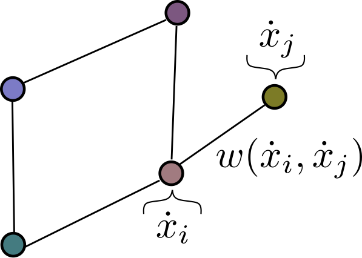

# Modeling Coupled Dynamical Systems Using Complex Networks
## By Audun Myers

# Overview

This software package provides code for analyzing and modeling coupled dynamical systems through complex networks networks. Coupled dynamical systems are present in many physical, biological, and social dynamical systems. This package will provide both data sets for these catagories as well as new and commonly used tools to analyze the resulting complex networks.

Specifically, this package will provide code for reproducing network representation methods and data sets used for modeling complex coupled dynamical systems such as Manufacturer-Supplier systems [[1]](#1). Additionally, the package will host both new and existing tools for analyzing these networks. These tools will range from traditional techniques to to more advanced topology based analysis methods [[2]](#2).

## References
<a id="1">[1]</a> 
MengkaiXu, Srinivasan Radhakrishnan, Sagar Kamarthi and Xiaoning Jin (2019). 
Resiliency of Mutualistic SupplierManufacturer Networks. 
Scientific Reports, Nature Research.

<a id="1">[2]</a> 
Zixuan Cang, Elizabeth Munch, and Guo-Wei Wei (2019). 
Evolutionary homology on coupled dynamical systems. 
Journal of Applied and Computational Topology, Springer.
