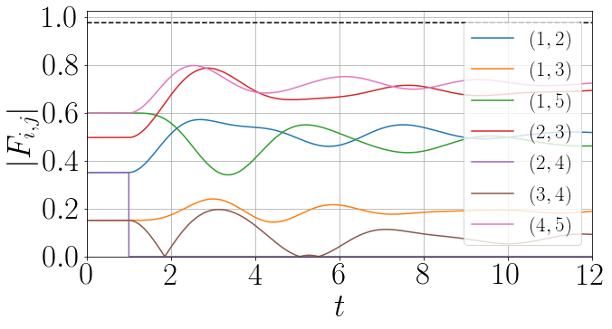

.. automodule:: dynamical_networks.simulate.MS_network
    :members:

The following is an example simulation of the supplier-manufacturer dynamical network::

    from dynamical_networks.simulate.PG_network import PG_network
    import matplotlib.pyplot as plt
    import numpy as np
    
    t = np.linspace(0,12, 5000)
    P_gen = 1
    P_con = 1
    K_0 = 1.63
    I_0 = 1 
    damping = 0.5
    alpha = 0.6
    V_gen = np.array([1, 4]) #vertices indices of generates and consumers
    V_con = np.array([0, 2, 3])
    A = np.array([[0, 1, 1, 0, 1],
                  [1, 0, 1, 1, 0],
                  [1, 1, 0, 1, 0],
                  [0, 1, 1, 0, 1],
                  [1, 0, 0, 1, 0]])
    
    
    
    Fs, E = PG_network(A, t, V_gen, V_con, K_0, P_gen, P_con, alpha, I_0, damping, e_cut = (2,4))
    
    
    #---------------PLOTTING-------------------
    
    plt.figure(figsize = (10,5))
    TextSize = 35
    for i in range(len(Fs)):
        plt.plot(t, Fs[i], label = '$('+str(E[i][0]+1)+','+str(E[i][1]+1)+')$')
    plt.plot([0,max(t)], [alpha*K_0, alpha*K_0], 'k--')
    
    plt.grid()
    plt.xlim(0,max(t))
    plt.ylim(0,)
    plt.xticks(size = TextSize)
    plt.yticks(size = TextSize)
    plt.xlabel(r'$t$', size = TextSize)
    plt.ylabel(r'$|F_{i,j}|$', size = TextSize)
    plt.legend(loc = 'upper right', fontsize = TextSize-12, ncol = 1)
    plt.show()

Where the output for this example is::

    Figure results

